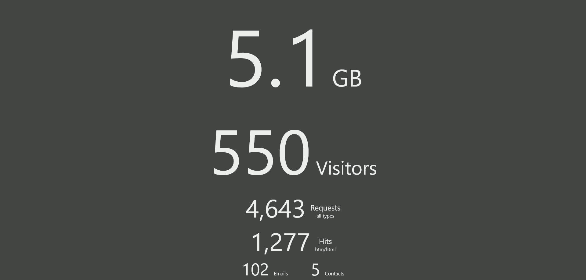

Bubbles the simple, easy to use HTTP web server that is browser controlled, and capable of serving static files over the internet, either streamed from disk, or direct from RAM without lag.

A GUI administration panel is accessed through your web browser (e.g. "http://localhost:1080/admin/" + default password of "admin"), which controls all her settings and vital functions, all in realtime.

Apart from serving files, she is capable of tracking site visits (site counters), receiving emails, accepting contact form submissions with support for Spam Guard, and recording site activity as date stamped traffic logs. She also includes a built-in log analyser for making sense of her traffic logs. These and other features make her more than capable of running multiple websites with little to no headache.

Her design is light and stable, and an extensive block-based memory management system ensures all her key operations use memory in a sustained and reliable manner. 

Features:
* Browser based administration panel
* HTTP/1 web server (default port 1080)
* SMTP email server (port 25)
* RAM Cache (static file server / diskless operation)
* Traffic Logs (date stamped filenames)
* Log Counter (analyse raw traffic logs)
* IP ban list + automatic add / remove functions (maintenance free operation)
* Inbox and Trash panels (view emails + contact form messages)
* Send mail (compose)
* Contact Form submission handler (stores and replies to contact form messages - no script or plug in required)
* Hit Counters with digital display (png image) for site specific / overall hit reporting
* Live Daily Status - realtime bandwidth, visitors, requests, hits, emails and contact form subsmissions (resets each day) updated every 30 minutes
* Built-in Tools: Icon Maker and Image Converter
* Command line support for basic settings (support for multiple commands at once)
* Run as a Windows Service (native install and uninstall options, requires Admin command prompt)
* Website Management panel (upload files, list files, delete files and reload files for one or more websites)
* Redirection panel (redirect to a file / url, or randomly from a list of files / urls)
* Virtual hosting for multiple domains / websites
* Map panel (reroute / map one domain to another)
* Proxy request support (test multiple domains / websites offline in your browser without the need for DNS)
* Block based memory handling for stable memory management
* Daily summary notices, boot notices, reload notices and security notices
* Mime Type panel (manage custom mime types / override defaults)
* Console panel (realtime statistics for bandwidth in, out, hits, connections etc)
* Threadless server design keeps things light
* Adjust all settings in your browser in realtime with no need to restart
* Optional 404.html page support (display this page for 404 File Not Found errors)
* Power Level (CPU usage) throttle to tweak performance on low power, shared, or weak CPU / v-core environments
* Backend server support for use with frontend servers like Caddy (e.g. for HTTPS)
* Built-in help (view offline without the need for internet)
* Compact binary ~1 MB
* Easy to use
* 32 bit codebase for wide deployment
* Smart source code (MIT license) supports both Delphi 3 and Lazarus 2
* Portable (when not installed as a Windows service)

# Download
<a href="src/bubbles.exe">bubbles.exe</a> - windows all
